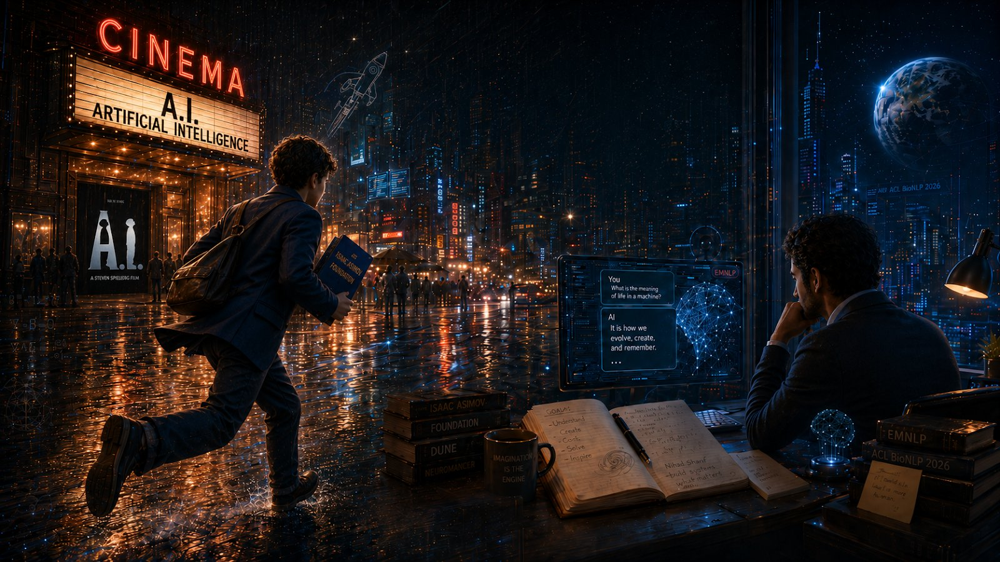
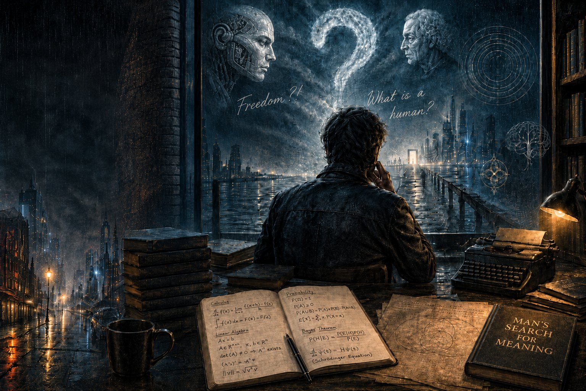

It's been almost two years since I've been away from this blog. I was drowning in the pursuit of a new obsession, one that had accompanied me for a long time but which I finally found a path toward. The obsession with Artificial Intelligence.

Back in 2000, I was a teenager not yet seventeen, fresh into university. I spent my early days sneaking out of the house to chase a passion that was somewhat forbidden back then: cinema. I would finish my lectures and rush to that vast, dark theater where glimpses of a fictional world shone bright. A world that only existed in the minds of dreamers entirely detached from reality. The screen flashes felt like swords tearing through the ugly cloak of reality, revealing a vast universe of imagination stretching far beyond the horizon.

I was just a teenager then. But instead of chasing girls or giving in to peer pressure to join my classmates for a smoke, I was chasing the future and everything it held for us. Sci-fi was my favorite genre, and despite how rare those movies were, I spent way more time with a film than its actual runtime. I would research its themes, learn from it, and explore the ideas it presented.

## The Early Days of the Internet

The internet had just arrived in the country, and cybercafés were slowly starting to pop up. One café near my university became my favorite hangout spot after the cinema. There, I would search and read about the infinite possibilities of the future, and about scientific discoveries that we once thought were pure fiction but had become reality.

I was fascinated by theoretical physics; teleportation experiments, time travel, the concept of time, and the different applications of Einstein's theories. But my biggest obsession was Artificial Intelligence.

To me, the most sci-fi concept of all was a human talking to a piece of metal, and that metal answering back.

It was pure madness... yet science was proving it could be possible!

Back then, time travel felt more realistic than talking to machines. But the more I learned about it, the more mind-blowing it seemed. My knowledge didn't come from scientific journals or rigid textbooks that turned the whole thing into a dull, narrow-minded technology that killed the imagination. Instead, I gathered everything I knew about AI from the novels of Isaac Asimov and Arthur C. Clarke, the stories of Nihad Sharif, and the dialogues of Mustafa Mahmoud.

## A Cinematic Heartbreak

That's why, when I saw a trailer for the movie *A.I. Artificial Intelligence* in the cinema one day, I got goosebumps from sheer excitement. The trailer was mysterious, thrilling, and featured two names that perfectly matched my youthful enthusiasm while carrying the ultimate seal of quality: Steven Spielberg and Isaac Asimov.

I eagerly followed the cinema schedules, waiting for the film to be released, letting my imagination run wild. I had read a lot of Asimov, but I didn't know which of his novels the movie was adapting, maybe one I hadn't read yet.

But the movie never made it to the theaters.

I asked at the box office but got no explanation. Time passed. My frustration and sadness over missing the film only grew. It was the early 2000s, and movie piracy wasn't booming like it would be years later. This left an annoying void inside me, but it only fueled my interest in AI. I started following the news. From time to time, claims of new scientific breakthroughs in AI would pop up, and I would rush to read about them, only to end up disappointed.

## The Gap Between Machine and Thought

My vision of AI was its ability to *think*. To debate. To answer a question without simply being programmed with a massive database of pre-written questions and answers, acting as nothing more than a search engine fetching a ready-made response.

I believed there was a massive difference between a machine and actual thought. A machine is mechanical; you program it for specific tasks, and it can't operate outside of them. Thinking, or true intelligence, means creating something new. Doing something you weren't programmed to do.

That's why my disappointments piled up with every new "breakthrough" in AI. For many years, I was convinced that this kind of AI would never happen, at least not in my lifetime. And if it did, it would be a century or two from now, and *I would not be around then*.

## Reclaiming Lost Passions

After finishing my Master's in Comparative Literature in 2017, I felt like I had reclaimed a part of myself. I had always loved thought, literature, and philosophy, and my studies immersed me in this world, satisfying a good chunk of that passion. That's why I started chasing my old dreams again. I thought about returning to my first love: studying mathematics, which I had abandoned in the endless hustle to make a living.

I dug out statistics books and bought Calculus textbooks. But once again, life got in the way. Work troubles, marital disputes, a divorce... and then a hellish pandemic struck the world, the likes of which we had only ever seen in movies.

So, I retreated to a quiet, lonely corner. I took out my math books, grabbed my laptop, and started killing time by rediscovering the pure mental joy of studying.

Then, out of nowhere, I decided to learn programming. The world was locked down with illness, news of death surrounded us, and working from home gave me an unprecedented amount of free time for self-reflection. I took two or three courses, chuckling to myself as I remembered that teenage boy whose passion I was finally feeding, albeit very late.

The world opened up again, the pandemic ended, and I stepped back out into life with new, heartwarming companionship, having regained a piece of what I had lost over the changing years.

## The Spark Reignited

By early 2023, I was approaching forty. The fiery enthusiasm and wild imagination of my youth had faded, replaced by a quiet calmness tinged with frustration at the misery of the world. I had stopped following AI news long ago, leaning instead toward fiction mixed with a dose of realism.

I had finally watched the movie *A.I.* years later, around 2015, if memory serves, and I didn't even like it. It felt overly philosophical, lacking imagination, and presented an illogical tragedy, in my opinion. It spoke to my logic, but not to my imagination or my obsession.

I had studied comparative literature alongside my career in finance. I satisfied an old craving by diving into the worlds of imagination, writing novels after spending a lifetime writing poetry. I published short novels (novellas) with some friends, then published three full novels: *Al-Qannas* (The Sniper), *Al-Awda mn al-Ganoub* (Return from the South), and *Hulm Evenza* (Evenza's Dream). I also had a bunch of unfinished manuscripts sitting in my desk drawer. I leaned a bit into philosophy, loved studying history, and drifted away from mathematics (my first passion), using it only as much as my job required for logical and numerical reasoning.

As I neared forty in early 2023, I heard the news, among many others, that a company had achieved a new breakthrough in artificial intelligence. I smiled sarcastically.

Finding out the truth was just a button-click away on my phone, but I didn't bother. I was utterly convinced it was no different from the dozens of past headlines about pathetic, laughable baby steps falsely labeled as "Artificial Intelligence."

I spent about three months in total denial, ignoring social media trends and my friends' chatter, fully convinced it was just another fad that would soon pass. Perhaps I just didn't want to stain an old dream with the depressing, frustrating reality and its fake claims. I had finally made peace with myself and didn't want to exhaust my spirit with unnecessary disappointment.

But when the buzz didn't die down, I sighed heavily and decided to give it a try. I pushed the button on my phone, and my eyes widened in sheer shock.

*Did it really happen?*

A tiny chat box managed to stir up a complete storm inside me.

A tiny chat box transported me back to being that young teenager standing at the cinema doors, clutching novels on public transport like a prized possession, promising himself a blissful evening far away in the fictional world he traveled to every night.

A tiny chat box captivated me and brought me back to myself, after all the disappointments the world had thrown my way.

## Down the Rabbit Hole

The discovery was mind-blowing. After testing the tool thousands of times, a burning desire grew inside me to know exactly how it worked under the hood!

I started a new phase of reading, following up, and trying to understand. The news and information were *overwhelming* and massive. I resumed my learning, diving back into the programming I had started a few years prior, and continued studying the math that had now become essential to grasp what was happening.

I was truly drowning in it, and mastering everything was impossible without structured, academic study. So, I embarked on a new journey: a Master's degree in Artificial Intelligence. Within the first few months, I experienced a cognitive and practical leap I had never imagined.

I immersed myself in research, projects, and various applications. Yet, I felt like something was wrong... there were flawed assumptions being made. A superficial understanding of what a "machine" truly means, even a smart one, versus what it means to be human.

My backgrounds in philosophy, literature, and mathematics intertwined to form a grand vision of what machine intelligence should be. I started pondering the gap between this vision and what was actually happening in reality.

Perhaps my grasp of language, my capacity for philosophical analysis, my skill with numbers and mathematical theories, and my lifelong obsession with literature and sci-fi, all of this made me feel that things were muddled and the standards were conflicting. I realized that they were going about it all wrong.

## Taking the Leap

That's when I decided to take a leap of faith. I submitted one of my AI research papers to a conference in Japan. I sat back, fully expecting a rejection, but in truth, I was just looking for a second opinion on my thoughts and a critique of my vision of how things should be.

But reality had other surprises in store for the forty-year-old trying to fulfill his teenage dreams so late in the game.

The paper was accepted.

I traveled to Kitakyushu to present it and discuss my ideas about the flawed assumptions made by the AI community. I followed that up with another paper accepted in Spain, and a third in America...

It was as if I were discovering a whole new world. I carried a hidden vision within me, alongside a deep, gut feeling that they were doing it all wrong. Stepping into these long debates with them was exhilarating, pushing me to get even more involved, like an addict who doesn't know how to stop.

This might just be the only frustration-free story of my life. Or perhaps, it was all crafted by the imagination of that teenage boy running from one cinema to another in the rain, hiding his novels so he could escape far away into their pages.

And maybe, just maybe, the forty-year-old man had to chase after the boy's dreams, running right behind him, in hopes of finally finding himself after being lost for so long.
