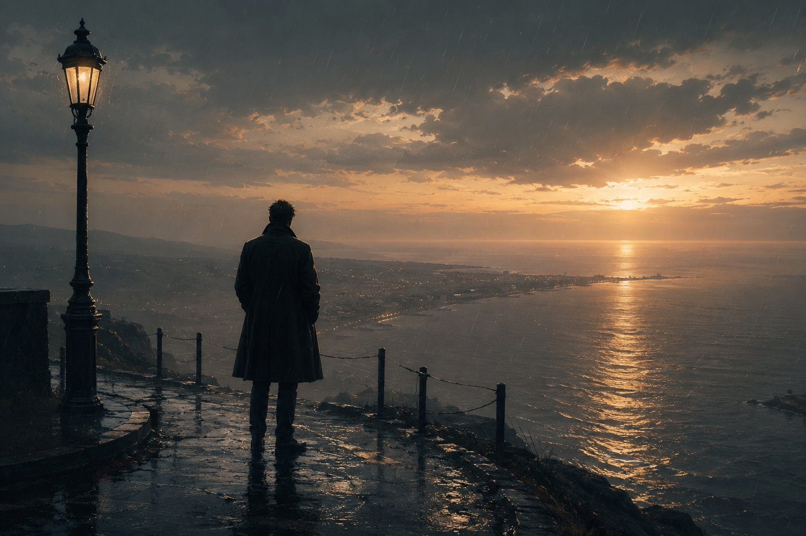

"What makes us who we are? What is it that truly forms our essence?"

This was the question that haunted my younger days, and to be honest, it still quietly troubles my heart today.

Who are we, really?

Who am I?

What whispers these thoughts into my mind, and what invisible hand pushes me to do the things I do?

Why did I walk down certain paths and not others?

Back then, I hadn't yet met Descartes or heard his famous words: "I think, therefore I am." But even if I had, I doubt it would have quenched my thirst. I wasn't doubting whether I existed; I was agonizing over *what* that existence meant.

Deep down, in a blurry, teenage way, I felt that I was merely the sum of my circumstances. The town where I was born, the faces I woke up to, the heavy events that fell upon my days—I felt they were steering my mind. Even though I felt this so deeply, Jean-Paul Sartre was a puzzle I couldn't solve. When he said, "Hell is other people," it just sounded like a cold, empty slogan to me.

Looking back, I know that if I had truly understood him then, I might have spared myself a lot of heartache. Because, truthfully, most of the people around me *were* a kind of hell. Aside from two gentle souls, I wanted nothing to do with anyone else. Yet, their shadows still shaped my days, pushing me further inward.

I retreated, sinking into my own quiet world, falling in love with books and fleeing to distant, imaginary lands. I walked that well-worn path of escapism, letting life happen to me without seeing how absurd the whole story really was.

I couldn't understand Sartre back then. I couldn't see how a man writing about such heavy things could suddenly pivot to a beautiful call for absolute freedom and ethical responsibility. He just seemed complicated and contradictory. I was too wrapped up in my own little miseries, trying so hard just to survive the harshness around me, and my only instinct was to run away from the pain.

It took me years to finally see what Sartre was trying to whisper to us. Unlike other philosophers, he was begging us not to blindly accept the shape that our pain and our past had molded us into. He was asking us to break free from the chains of our own experiences and rise toward the broader human principles of the modern world. Today, I look fondly at him as a social dreamer who used existentialism as a bridge to build a better society.

It is funny how so many thinkers started from the exact same place—looking at human experience—yet walked away with completely different stories. Look at John Locke; he gently imagined our minds as a blank slate, a pure white canvas waiting for life to paint its lessons upon it. Then there was David Hume, who saw us as chameleons, our colors changing with every step. To him, we are nothing but a fleeting series of feelings and thoughts, shifting so constantly that the very idea of a fixed "identity" almost fades away.

I read these great men back then, and I understood absolutely nothing. But when I finally stepped out of my teenage years, miraculously in one piece, I found Viktor Frankl. Oh, how I loved his breathtaking journey to find meaning and freedom in the darkest of places. Honestly, it was Frankl holding my hand that made me go back to Sartre and finally understand him. Even now, I find a sweet comfort in the idea that our existence comes first, and it is up to us to build our essence through good, ethical choices.

Then, I collided with Martin Heidegger. It wasn't a quiet meeting; it was a storm. Where Sartre was deeply ethical, Heidegger simply provoked me. The very first thing I read of his were his love letters to Hannah Arendt—the same philosopher who later tried to make sense of the banality of evil and the nature of revolution. I couldn't bring myself to believe a single word Heidegger said, except, perhaps, when he spoke about how impossible it is to truly translate a thought. His ideas about aligning oneself perfectly with the truth of the world felt less like philosophy and more like mystical poetry.

That reminded me of the ancient whispers of pantheism, of the soul merging with matter, bringing me back to the long, winding roads of Sufism I had walked, from Al-Hallaj to Ibn Arabi. It was a beautiful, dizzying maze that only tangled the simple truths of life into endless knots.

By my mid-twenties, I was mesmerized by how my desperate search for a simple answer had led me into these endless labyrinths. I marveled at how these brilliant minds could start at what seemed like the very beginning of understanding, only to end up with answers that couldn't sit in the same room together—bound only by the fact that they were all born from the womb of European modernity and materialistic thought.

But as the years passed, as I grew into my own skin and finally found the courage to decide who gets to stay in my life and who I must walk away from forever, the answer began to change its face.

"What makes us who we are?"

My heart finally answered: "It is our actions." Not what happened to us. Our choices are the ink that writes our identity.

Frankl had touched my soul with this truth: it is how we respond to the tragedies of life that defines us. It was nearly the essence of Sartre's philosophy, but softer. While Sartre asked us to respond out of a duty to ethics, Frankl asked us to find our own deeply personal value to light the way. I wrapped myself in this idea for a long time. I reveled in this newly found freedom. I learned to swallow my anger, to offer a gentle smile to my enemies, and to claim total ownership over how I spent my days.

And then, I stumbled upon Carl Jung and his concept of collective consciousness. I had always run away from Freud; his dark, sexual lenses felt too heavy, perhaps because they exposed terrifying things in me I wasn't ready to bear, or because they planted catastrophic thoughts in my head. I only read Freud because of my deep love for Frankl, and because someone once told me, "If you want to read psychology, you must start with Freud." So, my flight to Jung was really just a tired soul's attempt to go easy on itself.

Jung opened a window to a completely new world. The idea that we share a deep, hidden ocean of memories—a collective unconscious—was mesmerizing. The thought that we all share the same ancient symbols, visiting our dreams to shape who we are, woke me up to a frightening reality: I am not an island separate from the world. I am part of a much greater existence. And honestly, this felt like a disaster. How could I embrace the heavy unconscious of all humanity when I hadn't even figured out myself yet?

This realization dragged me right back to Descartes, to the very concept of the mind I had abandoned so quickly. But this time, it wasn't the sharp, conscious mind that knows exactly what it is thinking. It was the shadowed, quiet mind—the one that hoards images and memories, and disturbs our sleep. A mind that feels closer to a heart, a keeper of raw emotions.

This thought terrified me. This chaotic marriage of logic and feeling, of the mind and the heart, made me realize that "my identity" was a puzzle, a beautiful, frustrating mystery that simply couldn't be solved.

I had tried so hard to throw away the idea that our past dictates our future. I thought it was a sad, defeatist way to live. But I had to face it all over again when I knocked on the doors of modern French philosophy.

In my early thirties, during my master's studies, Michel Foucault became my wide-open gate into this modern thought. Before him, I only knew of the French thinkers through the fierce attacks of Abdelwahab Elmessiri against material modernity. Sadly, so little of their philosophy has been translated, and what has been translated remains locked in cold academic circles, hidden from the everyday reader. So, my meeting with them was purely academic.

Yet, Foucault's rebellious spirit spoke directly to the teenager still hiding inside me. Tearing down the structures of power was highly entertaining, and his tools were utterly fascinating. From his shadow, I walked into the worlds of Althusser, Jacques Derrida, Charles Taylor, Judith Butler's gender theory, Maurice Merleau-Ponty, and the whole phenomenological movement. They asked us to look at sensory experience as the very birthplace of identity and meaning. Phenomenology felt like a strange, haunting blend of David Hume, John Locke, William James, and John Dewey. And even though it sprouted from Marxism—which itself grew from a Hegelian seed—it felt entirely different to me.

It was a philosophy that stripped experience away from identity. There were no preconceived ideas, no essence preceding existence like Sartre claimed; there was only matter, nothing more. It was a beautiful, terrifying invitation to look at the world with a completely empty mind.

I tried.

I spent so much time meditating, trying to empty myself. But in the silence, I realized that the world simply reproduces itself. I found that even if I faced life with a completely blank mind and threw away every preconceived notion, my identity would just furiously knit itself back together. I failed to face my experiences without my own shadow falling over them. I realized, with a smile, that David Hume was right: my identity was doomed to be a series of fleeting impressions, changing every single moment.

By the time I finished my studies, I decided to avoid the question altogether. I surrendered. I let myself become a product of society, driven by politics and shaped by the endless economic grind, just seeking something to sustain my days.

And now, whenever life stops me in my tracks and asks, "Who on earth are you?"

I simply smile and answer: "I just don't know."
