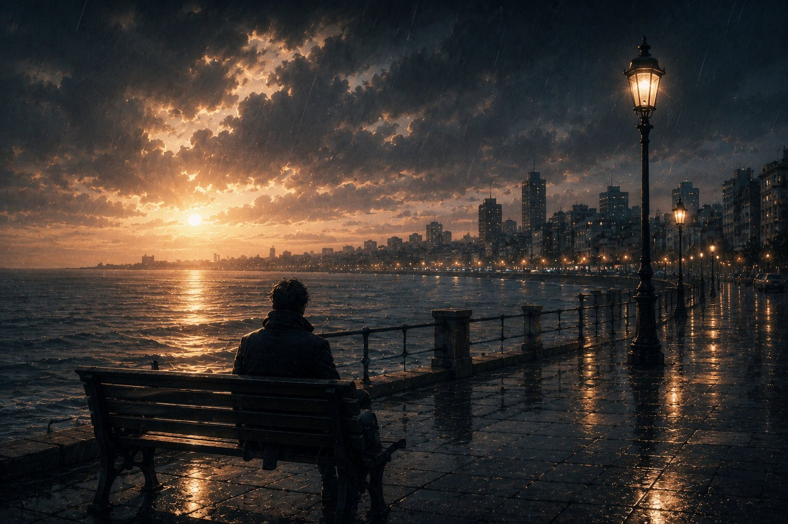

It was during a quiet movie night, just me and the kids. A beautiful song began to play, and suddenly, I was swept away, carried back to a version of myself from so many years ago—a boy I can now barely recognize. A heavy wave of melancholy washed over me. I wanted so desperately to reach out and hold that younger version of myself, but he remained a ghost, just out of my grasp.

<figure class="embed">
  
<iframe src="https://www.youtube-nocookie.com/embed/moSFlvxnbgk" title="Embedded video" loading="lazy" allow="accelerometer; clipboard-write; encrypted-media; gyroscope; picture-in-picture" allowfullscreen></iframe>

</figure>

In the complex, woven tapestry of our lives, there are decisions we make in the heat of the moment, or in the deep, quiet dark of despair, that leave permanent scars on our souls. One of the heaviest choices I ever wrestled with—almost without realizing I was doing it—was simply letting go of my belief in love. I wasn't just walking away from romance; I was tearing out the very cornerstone of my existence, abandoning the one idea that had kept me standing for so long.

## Goodbye to Love

Love, in all its beautiful shapes, is what molds us. It is the quiet hope in our darkest rooms, the warm embrace when we are breaking, the brush that paints our world in vivid, breathing colors. But when you throw that belief away, the world doesn't just lose its color—it becomes a stranger. My decision to walk away from love felt like throwing my compass into the sea while lost in a maze.

Without that belief to anchor me, I began to drift. It wasn't just about not having someone to hold, or the coldness in passing conversations. The very core of who I was began to dissolve. My joys, my sorrows, my burning passions, my quiet indifference, my dreams, and my nightmares—they all bled together into a flat, gray landscape. Without love to light the way, every feeling was muted, every experience hollowed out.

## An Expected Odyssey

When you grow up in a simple, middle or lower-middle-class home, there is always this quiet promise hanging in the air. It whispers to you that once you survive the grueling years of school, especially the golden gates of university, life will finally open up in all its glory. You believe there is a stage waiting just for you, a world ready to embrace everything you have to offer. These promises painted my young heart with vivid dreams of life and love.

I come from a generation that was fed phrases like, *"Tomorrow you'll be in college and you'll conquer the world,"* *"Just wait until after graduation, then you can do whatever you want,"* or *"After college, you will be free to love however you choose."*

## Twilight of Tradition

Back in the fading years of the eighties and nineties, life grew suffocatingly heavy for the shrinking middle class. The crushing weight of education, private tutoring, basic survival, and the heavy burden of raising children became too much. Faced with raising two kids, my parents chose to pour their energy into the less skilled child, leaving the more intelligent, capable one to face the harsh winds of life completely alone. The bitter truth I only understood much later was that their interventions only ever made things worse.

Back then, the soft ideas of "positive parenting" didn't exist. To parents of that era, raising a child meant nothing more than drilling the harsh lines between right and wrong, between what is *halal* and what is *haram*. And if you ruined their mood, the whip was waiting. My father never had the time, nor the desire, to look at my feelings; he only ever mocked them.

For me, trapped in those walls, my teenage years were a living hell. I just watched the clock, counting the agonizing days until I would no longer be "a minor"—that painful, humiliating word they threw in my face every chance they got. I was desperate for a way out of that house, sickened by the behaviors surrounding me, behaviors I rejected and, on some days, utterly hated.

## Echoes from a Bygone Era

As I grew up, a quiet whisper planted itself in my mind: *real life begins at university.* But after that...? After that, I was staring into a void. I had no earthly idea what life would look like, or what I even wanted to do with it.

University was a shimmering, golden fantasy in my mind. I believed I would finally be grown up, yet still young enough to be under the shelter of my parents. I thought I could finally look them in the eye, remind them I was becoming my own man, and beg them to stop belittling me and my heart.

But when those college years ended, the beautiful life I had imagined died with them. During university, I had thrown myself into writing poetry, passionately embracing love and the sheer thrill of being alive. I was mesmerized by the idea of two souls—a boy and a girl from completely different worlds—finding each other, sharing a vision, linking their fingers, and walking together to heal the broken parts of their lives. I dreamed they would vow never to repeat the foolish, painful mistakes of the adults who raised them.

I fell madly in love with love itself. That absolute miracle that stitches broken pieces together, bridges oceans between hearts, heals bleeding souls, and fills the eyes of dreamers with pure light.

All of this shaped how I looked at women. I saw the feminine soul as something mythical, a force capable of breathing miracles into the dirt. I confess, I carried that vision for a very long time, and perhaps a piece of it still lives in me. I still believe women are the true, beating heart of any society, meant to shape the world with their nobility and spiritual grace. I could never stomach the image of them descending into the brutal, dirty struggle of capitalism alongside men, fighting in a world as filthy as pigs wallowing in the mud, just to satisfy a hunger.

## Capitalist Chains

Maybe that is why my heart broke when I realized that women simply wanted to be seen as men in a different physical form. I learned they just wanted to step into the crushing gears of the labor market and grind in the mill alongside men, completely abandoning the beautiful uniqueness of their nature. They forgot the nobility of their spirit, which was meant to rise above, to inspire, and to lead it all.

I know, deeply, that this is the bitter fruit of capitalism. It is the result of a society drained of love, the terrified need to secure a future, the total collapse of trust, the burning urge to prove oneself, and all the other toxic rubbish that chokes us from every side.

The tragic irony is that men built this capitalist cage. They framed existence, history, and life itself through a cold, materialistic lens. They decided that physical matter was the only thing that counted. Perhaps they were just men whose hearts were too blind to see the true essence of love and companionship. They couldn't understand the beautiful, paradoxical intuition that women possess. So, they flattened human history into a rigid, exhausting, winding road that turned breathing souls into mere, lonely shadows.

## A World Where Love Was Whispered

I grew up in a house where love was a secret, a word almost too shameful to say out loud. If anyone dared to accidentally show their heart, they were laughed at. It feels as though the generation that raised us was either deeply ashamed of love, or completely broken and unable to feel it. They couldn't see past the edges of their own shadows.

My mother used to rummage through my things, terrified I would fall into the usual teenage traps—smoking, drinking, running with the wrong crowd. But I will never forget the day she found a piece of paper where I had poured out my poetry. Her face lit up; she stared at me in sheer wonder as she finally realized the kind of boy she had raised. She immediately interrogated me to make sure I hadn't written those words for a real girl. When she realized I was writing to an imaginary muse I only dreamed of meeting, her face fell into a look of deep regret, which soon turned into a pity she aimed at me for years.

My father's reaction was different. He smacked the back of my head and scoffed, *"What is this nonsense? Go study something that will actually feed you."*

## From Ivory Towers to Trenches

When I finally graduated, expecting freedom, life delivered its most brutal blow. I was thrust into the army for three suffocating years—the ugliest, darkest period of my life.

The worst part wasn't the physical exhaustion, though I did leave with a hardened body. The true agony was waking up every day surrounded by incredibly small-minded people whose only joy was exploiting power and breathing racism into everything they touched. Because I was an officer, I wasn't just a soldier kept safely away from the ugly truth, hiding with fellow recruits. I was forced to sit at the table with the other officers and senior commanders.

## A Soldier's Transformation

To take a young, civilian dreamer, pin a rank on his shoulders, and throw him into a pit of men who had breathed the military since their youth until their hair turned gray... it was, exactly as they say, like walking out of your home and straight into hell.

Imagine a world where military ranks dictate your worth as a human being. It isn't just about who is more skilled; it is a ladder that decides how many human rights you are allowed to have. It is the absolute ugliest form of racism and abuse of power. You suffer beneath the arrogant, crushing boots of those above you, and so you turn around and pass that psychological violence down to the poor souls below you. You become a part of the machine. And then, in the quiet of the night, the guilt eats you alive, leaving you feeling filthy, your conscience screaming until it dies.

## Shackled Hierarchy

When I finally walked out of the army, I carried its heavy, dark ghost inside my chest. Over the years that followed, I learned a terrifying truth: the sickness I saw in the military wasn't locked behind its gates. I saw it repeating, in different shades, in the souls of almost everyone I met. I worked everywhere—in government, the private sector, civil society, NGOs. The only difference was that out here, people wore nicer masks and pretended the darkness wasn't there. But the moment you lifted their veil, you found the exact same beast lurking inside.

The disappointments crashed over me, sometimes one by one, sometimes in massive waves. I was drowning in the most disgusting, suffocating loneliness. I was entirely alone with my thoughts. Just as Mahmoud Darwish once whispered: *Nothing resembles me, and nothing pleases me.*

I was trapped in my own quiet exile, living out every word of that song.

Slowly, the poetry inside me died. I ached for the days when I could close my eyes, imagine, and write. I tried so hard to write about love, but my pen would only bleed out hatred, violence, and trauma. I was stuck in the mud, sinking so deep I couldn't even see the sky anymore.

## Between Passion and Pragmatism

And so, in a quiet moment of sheer exhaustion and burning anger, I gave up. I threw the idea of love away. It felt like a stupid, childish fantasy, nothing more than the desperate daydreams of a trapped teenager trying to romanticize a bitter world. So, I let it go.

At first, it was a dark relief. *You are empty, and I am empty too. You worship matter, and I will worship it with you. Life is just atoms and dirt, just as your god Marx and his foolish followers claimed.* But beneath the surface, a terrible, heavy sadness was building inside me, and I swallowed it down.

Years slipped through my fingers. I spent them gathering the material things they all valued so deeply. But as soon as I held them, I found myself throwing them to the wind. I never had an ounce of respect for money. I spent nights, months, entire years dreaming of a world that could breathe without money, long before I ever read about the actual "non-monetary economy"—which turned out to be completely different from the poetic world I had imagined.

## Revelations by the Bedside

Sometimes, in the quiet hours, I would take out my old, yellowed papers and read my poetry. I felt a sweet nostalgia, but also a relief that I was free from the boy who suffered so much to write them. Yet, looking in the mirror, I realized I had become a stranger. I was someone desperately trying to find his way back home to his true self, standing in awe, wondering where all the years had gone.

Yes, it breaks my heart that I gave up on love, because for so long, love was the only thing that helped me understand who I was. But then I remember the harsh knock of my father's hand against the back of my head every time my mother found a scrap of paper where I had poured out my soul.

And now, a quarter of a century after those dark days, I sit beside my father's bed. He is over eighty now, fragile and worn. And we talk. He tells me stories of his own youth—how he used to sneak away to the movies, run home, and pour all his feelings into a notebook. He tells me how he used to sit and draw the beautiful girls at his college. He tells me how he spent decades of his life completely consumed by love, sacrificing everything he had for the people he loved, for his sister, for his massive family, expecting absolutely nothing in return. In the end, he lost so much. He suffered deeply, only to discover, with a broken heart, that it was all futile.

I sat there, utterly stunned.

## Echoes Across Time

He doesn't even remember punishing me for walking the very path he once walked. But looking at him, I finally understood. He hated seeing me repeat his tragedies. He couldn't bear to watch me drown in a fragile, romantic dream that didn't exist. He wanted to force my eyes open, to make me see the world for the filthy, cruel place it really is.

I understand him now. I appreciate the heavy burdens he carried. But I still cannot find it in my heart to justify what he did to me. I ache for his pain, I mourn the choices life forced upon him, but it does not give him the right to turn his trauma into a weapon against me. It doesn't justify taking his bitter anger at life and unleashing it on a young, fragile boy who knew nothing of the world.

I looked at him and asked, *"Why didn't you just talk to me? Why didn't you tell me what you were going through? Why were you so cruel? Why didn't you just tell me you wanted me to be strong?"* He looked back at me, smiled a tired, sarcastic smile, and whispered, *"Would you have understood?"*

Now, I spend my days trying to reconnect with a boy I lost twenty years ago. I try to look at my father's heart through his own eyes, trying to understand his motives, trying to rise above the pain. And I constantly wonder: Was there a hidden, painful wisdom in how he broke me? Or did he just push me blindly into a completely different tragedy?

I look now at my son, Suhaib. I shower him with absolute, unconditional love. I sit with him and talk to him like a grown man, even though he hasn't even reached his tenth birthday yet. And in the quiet of my heart, I wonder: *What tragedy am I accidentally leading you toward, my little boy? And when you are a man, how will you blame me?*
